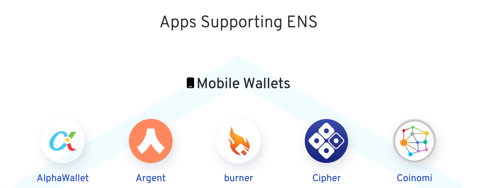

# ens.domains

Landing page for [ens.domains](https://ens.domains)

## Setup

```
git clone https://github.com/ensdomains/ens.domains
cd ens.domains
yarn
yarn develop
```

## Adding logos of integrated Dapps and Wallets

The success of ENS all depends on wallets and dapps to integrate ENS into your product and service.
To show support and recogninition of your hard work, we would love to list your brand in our website.

To enable ENS in your wallets and dapps, there are three ways.

- Resolve ENS names
- Support Reverse Resolution
- Let Users Name Things

Please read [our doc](https://docs.ens.domains/dapp-developer-guide/ens-enabling-your-dapp) for more information.

Once you integrate ENS, please raise pull request with the following steps.


### 0. Prep work: Fork our repo

Please follow [this instruction](https://akrabat.com/the-beginners-guide-to-contributing-to-a-github-project/) to learn the basic of how to contribute to open source project if this is your first time to do so.

### 1. Add your logo image

The category is either under `apps`, `desktop`, or `mobile`.

We recommend filename to be all lowercase with png file format

eg:
```
src/components/supportedApps
├── apps
├── desktop
├── mobile
│   ├── burnerwallet.png
```

### 2. Add metadata

Add `filename` of the image file you just as a key and set `link` and `name` data into `src/components/supportedApps/links.json`

eg:
```
  "burnerwallet": {
    "link": "https://xdai.io/",
    "name": "Burner Wallet"
  }
```

### 3. Make sure it displays correctly.

```
yarn develop
```

Open on http://localhost:8000 to check if your newly added logo is properly displayed.



### 4. Raise PR

When raising your pull request, please add the following informatin.

- Name
- Type
- Level of integration
- How to test (would help a lot if you add screenshot)
- Github repo (if the code is open sourced)

[Example PR](https://github.com/ensdomains/ens.domains/pull/42)

